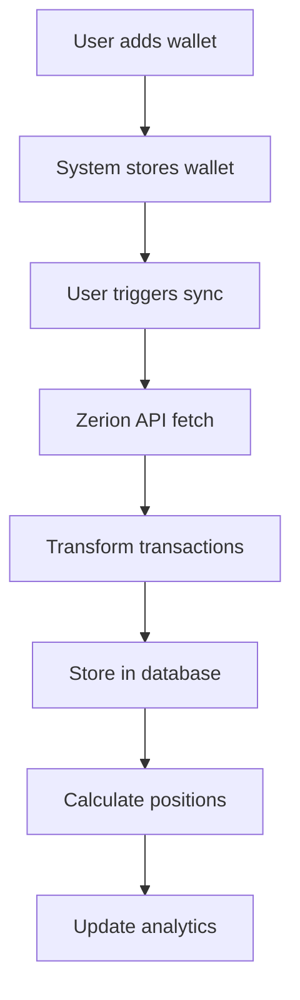

# ChainJournal (Journalio) - Complete Application Documentation

## Table of Contents
1. [Project Overview](#project-overview)
2. [Architecture](#architecture)
3. [Tech Stack](#tech-stack)
4. [Database Schema](#database-schema)
5. [Core Workflows](#core-workflows)
6. [API Endpoints](#api-endpoints)
7. [Business Logic](#business-logic)
8. [UI Components](#ui-components)
9. [Authentication & Security](#authentication--security)
10. [Data Flow](#data-flow)
11. [External Integrations](#external-integrations)
12. [Setup Instructions](#setup-instructions)
13. [Enhancement Opportunities](#enhancement-opportunities)

---

## Project Overview

**ChainJournal** (also known as Journalio) is a professional cryptocurrency trading journal and analytics platform designed for serious crypto traders. It helps users track their trades, analyze performance, identify mistakes, and improve their trading strategies through detailed journaling and analytics.

### Key Features
- **Trade Management**: Import, view, edit, and manage cryptocurrency trades
- **Multi-Wallet Support**: Track trades across multiple wallets and chains
- **Advanced Journaling**: Voice notes, file uploads, ratings, tags, and rich text notes
- **Mistake Tracking**: Categorize and learn from trading errors
- **Position Tracking**: FIFO-based position calculation for tax compliance
- **Analytics Dashboard**: P&L analysis, win rate, portfolio metrics
- **External API Integration**: Automated trade import from Zerion (formerly OKX)

### Target Users
- Active cryptocurrency traders
- DeFi users
- Portfolio managers
- Tax-conscious traders needing FIFO tracking

---

## Architecture

### Application Type
- **Framework**: Next.js 16.1.6 with App Router
- **Deployment Model**: Full-stack web application
- **Architecture Pattern**: Server-side rendering with API routes

### Directory Structure
```
journalio-new/
├── src/
│   ├── app/                    # Next.js App Router pages and API routes
│   │   ├── api/                # Backend API endpoints
│   │   ├── dashboard/          # Protected dashboard pages
│   │   ├── sign-in/            # Authentication pages
│   │   └── layout.tsx          # Root layout
│   ├── components/             # Reusable React components
│   │   ├── ui/                # Shadcn/ui base components
│   │   ├── analytics/          # Analytics-specific components
│   │   ├── trades/             # Trade management components
│   │   ├── journaling/         # Journal entry components
│   │   └── wallet/             # Wallet management components
│   ├── lib/                    # Utility functions and services
│   │   ├── algorithms/         # FIFO position tracking
│   │   ├── storage/            # Supabase storage integration
│   │   └── audio/              # Voice recording utilities
│   ├── services/               # External service integrations
│   │   └── zerion/             # Zerion API integration
│   └── types/                  # TypeScript type definitions
├── prisma/
│   └── schema.prisma           # Database schema definition
└── public/                     # Static assets
```

---

## Tech Stack

### Frontend
- **React 19.0.0**: UI library
- **Next.js 16.1.6**: Full-stack framework with App Router
- **TypeScript 5**: Type-safe development
- **Tailwind CSS 3.4.1**: Utility-first CSS
- **Shadcn/ui**: Component library built on Radix UI
- **Recharts 3.7.0**: Data visualization
- **React Hook Form 7.71.1**: Form management
- **Zod 4.3.6**: Schema validation
- **Zustand 5.0.11**: State management
- **Tanstack Query 5.90.21**: Server state management

### Backend
- **Next.js API Routes**: Backend endpoints
- **Prisma 6.19.2**: ORM and database toolkit
- **PostgreSQL**: Primary database
- **Clerk**: Authentication service
- **Axios**: HTTP client for external APIs

### External Services
- **Zerion API**: Blockchain transaction data
- **Supabase**: File storage for journal attachments
- **Solana Web3.js**: Blockchain interaction

---

## Database Schema

### Core Entities

#### User
- Manages user accounts linked to Clerk authentication
- Fields: `id`, `clerkId`, `email`, `name`, `avatarUrl`
- Relations: Has many wallets

#### Wallet
- Cryptocurrency wallet addresses for tracking
- Fields: `id`, `address`, `chain`, `label`, `isActive`, `userId`
- Relations: Belongs to user, has many trades

#### Trade
- Individual trading transactions
- Key Fields:
  - `signature`: Unique transaction identifier
  - `type`: Trade type (buy/sell/swap)
  - `tokenIn/tokenOut`: Trading pair
  - `amountIn/amountOut`: Quantities
  - `priceIn/priceOut`: Token prices
  - `source`: Data source (IMPORTED/MANUAL/ZERION)
  - `dataSource`: Integration source (zerion/manual/solana-rpc)
- Relations: Belongs to wallet, has position trades, audit logs, mistakes

#### Position
- FIFO-calculated trading positions
- Fields: `symbol`, `walletAddress`, `openDate`, `closeDate`, `status`, `avgEntryPrice`, `avgExitPrice`, `realizedPnL`
- Relations: Has many position trades

#### JournalEntry
- Trading journal entries with multimedia support
- Fields: `type`, `targetId`, `userId`, `title`, `content`, `tags`, `rating`
- Relations: Has many journal files

#### TradeMistake
- Trading mistake tracking and analysis
- Fields: `tradeId`, `mistakeType`, `severity`, `emotionalState`, `notes`
- Categories: EMOTIONAL, RISK_MANAGEMENT, STRATEGY, TIMING, TECHNICAL, CUSTOM

---

## Core Workflows

### 1. Trade Import Workflow


**Implementation**:
- Endpoint: `/api/zerion/sync`
- Service: `ZerionSyncService`
- Transformer: `ZerionTransformer`
- Process:
  1. Fetch transactions from Zerion API
  2. Transform to internal trade format
  3. Deduplicate using `zerionTxId`
  4. Store with confidence levels
  5. Update sync status

### 2. Manual Trade Entry
- Form: `ManualTradeForm` component
- Validation: Zod schema
- Storage: Direct database insert with `source: MANUAL`
- Audit: Creates audit log entry

### 3. Position Calculation (FIFO)
- Algorithm: `FIFOPositionTracker`
- Process:
  1. Sort trades chronologically
  2. Maintain per-token FIFO queues
  3. Match buys with sells
  4. Calculate realized P&L
  5. Track open positions

### 4. Journal Entry Creation
- Components: `JournalEntry`, `VoiceRecorder`, `FileUpload`
- Storage:
  - Text content in database
  - Files in Supabase storage
  - Voice recordings as audio files
- Features:
  - Rich text editor
  - Tag management
  - 1-5 star ratings
  - File attachments

---

## API Endpoints

### Trade Management
- `GET /api/trades` - List all trades with filters
- `GET /api/trades/[tradeId]` - Get single trade
- `POST /api/trades/manual` - Create manual trade
- `PUT /api/trades/[tradeId]` - Update trade
- `DELETE /api/trades/[tradeId]` - Delete trade

### Wallet Management
- `GET /api/wallets` - List user wallets
- `POST /api/wallets` - Add new wallet
- `PUT /api/wallets/[walletId]` - Update wallet
- `DELETE /api/wallets/[walletId]` - Remove wallet

### Synchronization
- `POST /api/zerion/sync` - Trigger Zerion sync
- `GET /api/sync/providers` - Get sync status
- `POST /api/cron/daily-sync` - Automated daily sync

### Analytics
- `GET /api/analytics/metrics` - Portfolio metrics
- `GET /api/analytics/positions` - Position data
- `GET /api/analytics/trades` - Trade statistics
- `GET /api/analytics/mistakes/frequency` - Mistake analysis

### Journal
- `GET /api/journal/entries` - List journal entries
- `POST /api/journal/entries` - Create entry
- `POST /api/journal/upload` - Upload attachment

---

## Business Logic

### Trade Processing
1. **Import**: Fetch from external API (Zerion)
2. **Transform**: Convert to internal format
3. **Validate**: Check required fields
4. **Deduplicate**: Prevent duplicate entries
5. **Store**: Save to database
6. **Analyze**: Calculate metrics

### Position Tracking (FIFO)
```typescript
// Core FIFO Algorithm
class FIFOPositionTracker {
  processTrade(trade) {
    if (trade.type === 'buy') {
      // Add to FIFO queue
      queue.push({quantity, price, timestamp})
    } else {
      // Remove from FIFO queue
      while (sellQuantity > 0 && queue.length > 0) {
        const entry = queue.shift()
        // Calculate P&L
        pnl = (sellPrice - entry.price) * quantity
      }
    }
  }
}
```

### P&L Calculation
```typescript
calculatePnL(trade) {
  const valueIn = amountIn * priceIn
  const valueOut = amountOut * priceOut
  const feesUSD = fees * feeTokenPrice
  const pnl = valueOut - valueIn - feesUSD
  const pnlPercentage = (pnl / valueIn) * 100
}
```

### Mistake Tracking
- Predefined categories with custom additions
- Severity levels: LOW, MEDIUM, HIGH
- Emotional state tracking
- Learning points and prevention strategies

---

## UI Components

### Key Components

#### Dashboard Components
- `CombinedDashboard`: Main dashboard view
- `MetricsOverview`: Key performance metrics
- `PnLChart`: Profit/loss visualization
- `TradesTable`: Trade list with actions

#### Trade Components
- `ManualTradeForm`: Manual trade entry
- `TradeEditor`: Edit existing trades
- `TradeActions`: Quick actions menu

#### Journal Components
- `JournalEntry`: Entry creation/editing
- `VoiceRecorder`: Audio note recording
- `FileUpload`: Drag-and-drop attachments
- `MistakeSelector`: Mistake categorization

#### Analytics Components
- `AnalyticsDashboard`: Full analytics view
- `PositionOverview`: Position summary
- `MistakeTracker`: Mistake analysis

### UI Library (Shadcn/ui)
- Pre-built components using Radix UI
- Customizable with Tailwind CSS
- Components: Button, Card, Dialog, Form, Table, etc.

---

## Authentication & Security

### Authentication (Clerk)
- Provider: Clerk authentication service
- Implementation: `ClerkProvider` wrapper
- Middleware: Protected routes in `middleware.ts`
- User management: Linked via `clerkId`

### Security Measures
1. **API Security**:
   - Authentication required for all endpoints
   - User isolation (users only see their data)
   - Input validation with Zod

2. **Data Protection**:
   - Encrypted API keys (planned)
   - Secure file uploads to Supabase
   - SQL injection prevention via Prisma

3. **Rate Limiting**:
   - External API rate limit handling
   - Delay between API calls

---

## Data Flow

### Trade Import Flow
```
User → Add Wallet → Trigger Sync → Zerion API → Transform
→ Validate → Store → Calculate Positions → Update UI
```

### Journal Entry Flow
```
User → Create Entry → Upload Files → Store Text → Upload to Supabase
→ Link to Trade → Update Tags → Display in UI
```

### Analytics Flow
```
Database → Aggregate Trades → Calculate Metrics → Generate Charts
→ Filter/Sort → Display Dashboard
```

---

## External Integrations

### Zerion API Integration
- **Purpose**: Import blockchain transactions
- **Client**: `ZerionClient` class
- **Service**: `ZerionSyncService`
- **Transformer**: `ZerionTransformer`
- **Features**:
  - Pagination support
  - Multi-chain support
  - Trade type detection
  - Confidence scoring

### Migration from OKX
- Legacy tables preserved for data migration
- Fields: `okxTxHash`, `okxImportedAt`, `okxRawData`
- Status: Deprecated, replaced by Zerion

### Supabase Storage
- **Purpose**: Store journal attachments
- **Service**: `SupabaseStorageService`
- **Features**:
  - File upload/download
  - Public URL generation
  - File type validation

---

## Setup Instructions

### Prerequisites
- Node.js 18+
- PostgreSQL database
- Environment variables

### Environment Variables
```env
# Database
DATABASE_URL="postgresql://..."

# Authentication
NEXT_PUBLIC_CLERK_PUBLISHABLE_KEY="..."
CLERK_SECRET_KEY="..."

# External APIs
ZERION_API_KEY="..."

# Storage
NEXT_PUBLIC_SUPABASE_URL="..."
NEXT_PUBLIC_SUPABASE_ANON_KEY="..."
```

### Installation Steps
```bash
# 1. Clone repository
git clone [repository-url]
cd journalio-new

# 2. Install dependencies
npm install

# 3. Setup database
npx prisma generate
npx prisma migrate dev

# 4. Run development server
npm run dev
```

### Database Setup
```bash
# Generate Prisma client
npx prisma generate

# Run migrations
npx prisma migrate dev

# Seed database (optional)
npx ts-node scripts/seed-trades.ts
```

---

## Enhancement Opportunities

### High Priority
1. **Real-time Price Updates**
   - Integrate price feed API
   - Calculate live P&L
   - Update unrealized gains

2. **Advanced Position Management**
   - Edit position groupings
   - Support for complex strategies
   - Multiple exit tracking

3. **Mobile App**
   - React Native version
   - Push notifications
   - Offline support

### Medium Priority
1. **Tax Reporting**
   - Generate tax reports
   - Export to tax software
   - Multi-jurisdiction support

2. **Strategy Backtesting**
   - Historical analysis
   - What-if scenarios
   - Performance comparison

3. **Social Features**
   - Share strategies
   - Follow traders
   - Performance leaderboards

### Low Priority
1. **AI Analysis**
   - Trade pattern recognition
   - Mistake prediction
   - Strategy suggestions

2. **Advanced Charts**
   - TradingView integration
   - Custom indicators
   - Multi-timeframe analysis

3. **Automated Trading**
   - Strategy execution
   - Risk management rules
   - Alert system

### Technical Improvements
1. **Performance**
   - Implement caching (Redis)
   - Optimize database queries
   - Add pagination everywhere

2. **Testing**
   - Add unit tests
   - Integration tests
   - E2E tests with Playwright

3. **Monitoring**
   - Error tracking (Sentry)
   - Performance monitoring
   - Usage analytics

4. **DevOps**
   - CI/CD pipeline
   - Docker containerization
   - Kubernetes deployment

---

## Current Status

### Completed Features
- ✅ Multi-wallet management
- ✅ Zerion API integration
- ✅ Manual trade entry
- ✅ Basic journaling
- ✅ Voice recording
- ✅ File uploads
- ✅ Mistake tracking
- ✅ Basic analytics
- ✅ FIFO position algorithm

### In Progress
- 🔄 Real-time price updates
- 🔄 Advanced position editing
- 🔄 Tax report generation

### Planned
- 📅 Mobile application
- 📅 Advanced charting
- 📅 Social features
- 📅 AI-powered insights

---

## Code Quality Guidelines

### TypeScript Best Practices
- Strict type checking enabled
- Interfaces for all data models
- Proper error handling
- No `any` types

### Component Structure
- Functional components with hooks
- Proper prop typing
- Memoization where needed
- Lazy loading for performance

### API Design
- RESTful conventions
- Consistent error responses
- Input validation
- Proper status codes

### Database Practices
- Indexed queries
- Transaction support
- Soft deletes where appropriate
- Audit logging

---

## Migration Notes

### From OKX to Zerion
The application recently migrated from OKX API to Zerion API for transaction data. Legacy OKX fields are preserved in the database for backward compatibility but are deprecated.

### Key Changes:
1. **API Client**: `OKXClient` → `ZerionClient`
2. **Sync Service**: `OKXSyncService` → `ZerionSyncService`
3. **Database Fields**: Added `zerionTxId`, `zerionRawData`, etc.
4. **Confidence Scoring**: New feature for data quality

---

## Support & Documentation

### Key Files to Review
1. `/prisma/schema.prisma` - Database schema
2. `/src/services/zerion/` - External API integration
3. `/src/lib/algorithms/position-tracker.ts` - FIFO logic
4. `/src/app/api/` - All API endpoints
5. `/src/components/` - UI components

### Common Issues & Solutions
1. **Sync Failures**: Check API key and rate limits
2. **Position Mismatches**: Review FIFO algorithm
3. **Missing Trades**: Check deduplication logic
4. **UI Issues**: Clear browser cache

### Development Tips
1. Use `npm run dev` for hot reload
2. Check Prisma Studio for database: `npx prisma studio`
3. Test API endpoints with Postman/Insomnia
4. Use React DevTools for component debugging

---

## Conclusion

ChainJournal is a comprehensive trading journal application with robust features for trade tracking, analysis, and improvement. The modular architecture allows for easy enhancement and scaling. The migration from OKX to Zerion demonstrates the flexibility of the design. With the foundation in place, the application is ready for additional features like real-time pricing, advanced analytics, and mobile support.

This documentation provides everything needed to understand, maintain, and enhance the application. The codebase follows modern best practices and is structured for long-term maintainability and growth.